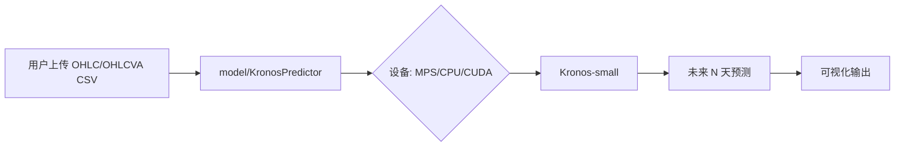

# Kronos CS2 皮肤价格预测 DEMO

> 本项目演示如何将 **Kronos** —— 一个在 45+ 全球交易所数据上预训练的时序大模型 —— 迁移应用于 **CS2 皮肤价格趋势预测**。

---

## Web Demo

试用基于 Gradio 的 Web 演示来上传皮肤价格 CSV 并查看 Kronos 预测结果。

点击下方徽章，在 Hugging Face Spaces 中直接试用本项目：

[](https://huggingface.co/spaces/ByronWang2005/Kronos-CS2-Skins-Forecast-Demo)


---

## 架构图



---

## 快速开始（本地运行）

### 前置要求
- Python ≥ 3.10  
- Conda（推荐）

### 安装步骤

```bash
# 克隆仓库
git clone https://github.com/byronwang2005/Kronos-CS2-Skins-Forecast.git
cd Kronos-CS2-Skins-Forecast

# 创建并激活 conda 环境
conda create -n kronos python=3.10 -y
conda activate kronos

# 安装依赖
pip install -r requirements.txt

# 生成单皮肤OHLC+OHLCVA示例数据，备用
# python examples/generate_synthetic_skin.py

# 生成500个皮肤OHLC+OHLCVA示例数据，主用
python examples/generate_500_skins.py

# 运行示例OHLC数据预测
python examples/prediction_example.py

# 运行示例OHLCVA数据预测（含 volume/amount）
python examples/prediction_full_example.py
```

你将看到结果图表，对比历史价格与预测价格 —— 全程在本地运行（自动启用 Metal / CUDA 加速，如支持）。

以下是一个项目早期基于500个皮肤示例数据生成的预测（OHLC vs. OHLCVA）（部分结果，仅代表当时展示效果）：


---

## 仓库结构

```
Kronos-CS2-Skins-Forecast/
├── model/                          # Kronos 官方模型代码（来自 shiyu-coder/Kronos）
├── examples/
│   ├── generate_synthetic_skin.py  # 生成单皮肤 OHLC+OHLCVA 示例数据
│   ├── generate_500_skins.py       # 生成 500 个皮肤 OHLC+OHLCVA 示例数据
│   ├── data/                       # 合成/预测的数据
│   │   ├── synthetic_skin_ohlc.csv
│   │   ├── synthetic_skin_full.csv
│   │   ├── synthetic_500_skins_ohlc.csv
│   │   ├── synthetic_500_skins_full.csv
│   │   ├── predictions_500_skins.csv
│   │   └── predictions_500_skins_full.csv
│   ├── prediction_example.py       # 示例 OHLC 数据预测
│   └── prediction_full_example.py  # 示例 OHLCVA 数据预测
├── src/predictor.py                # 核心预测逻辑
├── figures/
├── app.py                          # Gradio 界面，在本 repo 的文件可能并非最新版本
├── README.md
├── requirements.txt
├── .gitignore
└── LICENSE                         # MIT 许可证
```

---

## 依赖项

- `torch`（支持 Apple Silicon 的 MPS）  
- `pandas`, `numpy`  
- `matplotlib`  
- `gradio`  
- `transformers`（用于加载 Kronos）  
- ......

详见 [`requirements.txt`](requirements.txt)。

---

## 致谢

本项目基于：

- **[Kronos](https://github.com/shiyu-coder/Kronos)**（作者：Yu Shi 等）  
  - 论文：[Kronos: A Foundation Model for the Language of Financial Markets](https://arxiv.org/abs/2508.02739)  
  - 模型：Hugging Face 上的 [`NeoQuasar/Kronos-small`](https://huggingface.co/NeoQuasar/Kronos-small)

如在研究中使用本项目，请引用 Kronos 论文：

```bibtex
@misc{shi2025kronos,
  title={Kronos: A Foundation Model for the Language of Financial Markets},
  author={Yu Shi and Zongliang Fu and Shuo Chen and Bohan Zhao and Wei Xu and Changshui Zhang and Jian Li},
  year={2025},
  eprint={2508.02739},
  archivePrefix={arXiv},
  primaryClass={q-fin.ST}
}
```

---

## 开源协议

本项目采用 MIT 协议开源，详见 [LICENSE](LICENSE) 文件。
继承自 [Kronos](https://github.com/shiyu-coder/Kronos) 的开源协议。

---

**Made with ❤️ for CS2 skin lovers**  
By Byron | [GitHub](https://github.com/byronwang2005/Kronos-CS2-Skins-Forecast)
