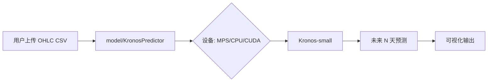

# 🔮 Kronos CS2 皮肤价格预测（本项目处于开发阶段）

> **使用 Kronos（首个开源金融 K 线基础模型）预测 CS2 皮肤价格走势的开源项目**

本项目演示如何将 **Kronos** —— 一个在 45+ 全球交易所数据上预训练的时序大模型 —— 迁移应用于 **CS2 皮肤价格趋势预测**。我们提供了一个**干净、可复现、合规**的分析工具，适用于研究与教育目的。

---

## 🎯 项目目标

- 展示**金融时序大模型**在游戏资产预测中的跨领域迁移能力  
- 构建一个**开源、合规、可演示**的端到端预测工具  

> ✅ **本项目不包含、也不提供任何真实皮肤价格数据**。用户需自行提供合规数据（例如：从 Steam 社区市场手动导出）。

---

## ⚠️ 免责声明

> **本项目不提供真实的 CS2 皮肤价格数据。**  
> - 我们**不会爬取** Steam、steamcommunity.com 或任何第三方网站。  
> - 所有预测结果**仅用于研究与教育目的**，**不构成任何投资或交易建议**。  
> - 用户需自行确保其数据来源符合 [Steam Web API 使用条款](https://developer.valvesoftware.com/wiki/Steam_Web_API) 及 [Steam 用户协议](https://store.steampowered.com/subscriber_agreement/)。  
> - 本项目作者**与 Valve、Steam 或 CS2 无任何关联**。

---

## 🧠 工作原理

Kronos 将价格时序视为一种“金融语言”（K 线序列）。我们的流程如下：

1. 用户上传历史皮肤价格 CSV（需包含 `timestamps, open, high, low, close`）  
2. 数据输入 **Kronos-small**（2470 万参数）—— 一个预训练的基础模型  
3. 模型生成未来 N 天的价格预测（支持概率采样）  
4. 可视化结果（图表 + JSON）

### 架构图



---

## 🚀 快速开始（本地运行）

### 前置要求
- Python ≥ 3.10  
- Conda（推荐）

### 安装步骤

```bash
# 克隆仓库
git clone https://github.com/byronwang2005/Kronos-CS2-Skins-Forecast.git
cd Kronos-CS2-Skins-Forecast

# 创建并激活 conda 环境
conda create -n kronos python=3.10 -y
conda activate kronos

# 安装依赖
pip install -r requirements.txt

# 生成合成示例数据
python examples/generate_synthetic_skin.py

# 运行预测（仅 OHLC）
python examples/prediction_example.py

# 运行预测（含 volume/amount）
python examples/prediction_full_example.py
```

你将看到一张图表，对比历史价格与预测价格 —— 全程在本地运行（自动启用 Metal 加速，如支持）。

---

## 📁 仓库结构

```
Kronos-CS2-Skins-Forecast/
├── model/                          # Kronos 官方模型代码（来自 shiyu-coder/Kronos）
├── examples/
│   ├── generate_synthetic_skin.py  # 生成合成数据（含 OHLC / OHLCV）
│   ├── synthetic_skin_data.csv     # 合成数据（仅 OHLC）
│   ├── synthetic_skin_full.csv     # 合成数据（含 volume/amount）
│   ├── prediction_example.py       # 仅 OHLC 的预测示例
│   └── prediction_full_example.py  # 含 volume/amount 的预测示例
├── src/predictor.py                # 核心预测逻辑（开发中）
├── demo/app.py                     # Gradio Web 界面（开发中）
├── README.md
├── requirements.txt
├── .gitignore
└── LICENSE                         # MIT 许可证
```

---

## 📦 依赖项

- `torch`（支持 Apple Silicon 的 MPS）  
- `pandas`, `numpy`  
- `matplotlib`  
- `gradio`  
- `transformers`（用于加载 Kronos）  

详见 [`requirements.txt`](requirements.txt)。

---

## 🤝 致谢

本项目基于：

- **[Kronos](https://github.com/shiyu-coder/Kronos)**（作者：Yu Shi 等）  
  - 论文：[Kronos: A Foundation Model for the Language of Financial Markets](https://arxiv.org/abs/2508.02739)  
  - 模型：Hugging Face 上的 [`NeoQuasar/Kronos-small`](https://huggingface.co/NeoQuasar/Kronos-small)

如在研究中使用本项目，请引用 Kronos 论文：

```bibtex
@misc{shi2025kronos,
  title={Kronos: A Foundation Model for the Language of Financial Markets},
  author={Yu Shi and Zongliang Fu and Shuo Chen and Bohan Zhao and Wei Xu and Changshui Zhang and Jian Li},
  year={2025},
  eprint={2508.02739},
  archivePrefix={arXiv},
  primaryClass={q-fin.ST}
}
```

---

## 📜 许可证

MIT 许可证 —— 详见 [`LICENSE`](LICENSE)。  
继承自 [Kronos](https://github.com/shiyu-coder/Kronos) 的开源协议。

---

## 📬 反馈与贡献

欢迎提交 PR，例如：
- 改进 UI/UX  
- 支持批量预测  
- 添加回测功能（仅限用户自有数据）  

**注意**：**请勿提交真实皮肤价格数据或爬虫脚本**。

**Made with ❤️ for CS2 skin lovers**  
By Byron | [GitHub](https://github.com/byronwang2005/Kronos-CS2-Skins-Forecast)
